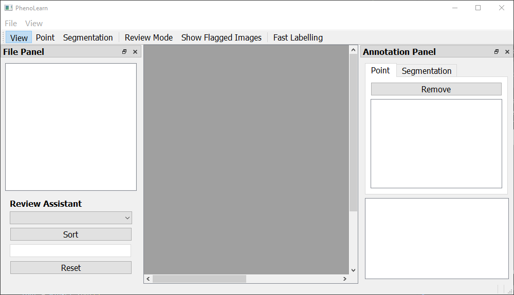
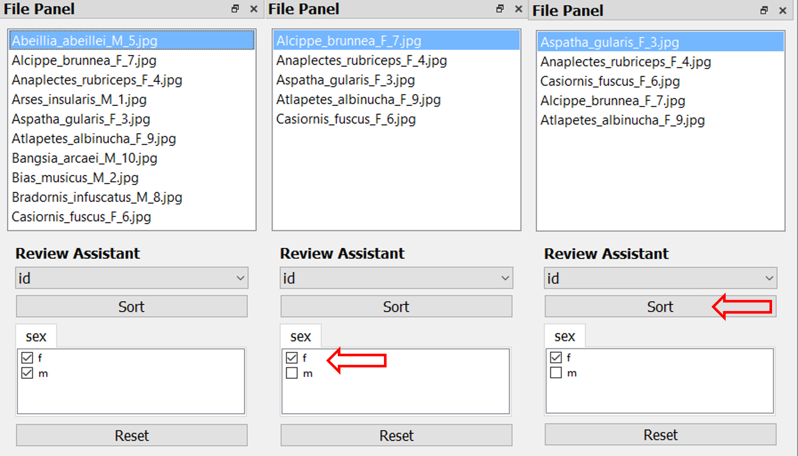

# PhenoLearn

‘PhenoLearn’ (github.com/EchanHe/PhenoLearn) is an open-source image analysis tool that is designed for high-throughput phenotype measuring on digital biodiversity datasets. It can (i) generates annotations (currently points and segmentation) (ii) use deep learning models to train and predict annotations (iii) Review and edit predictions.

## Table of Contents
-   [Features](#features)
-   [Installation](#installation)
-   [Get demo datasets](#get-demo-datasets)
-   [Usage](https://chat.openai.com/?model=gpt-4#usage)
-   [License](#license)
-   [Contact](#contact)  

## Features

PhenoLearn has two parts:
Label and Deep Learning

- Image Labeling: Explain the functionality and benefits of your image labeling feature here.
- Training Deep Learning Models: Explain the functionality and benefits of your deep learning training feature here.
- Reviewing Deep Learning Predictions: Explain the functionality and benefits of your prediction reviewing feature here.
Add more features as needed
## Installation
Before you start the installation, make sure your system meets the following requirements:

-  Python (Verions >=3.6) installed. If you don't have Python installed, you can get it from [Python](https://www.python.org/downloads/) or [Anaconda Python](https://www.anaconda.com/download). We recommend Anaconda Python, as it has Conda included.
-   pip (Python Package Installer), which typically comes with the Python installation
-   Conda, an open-source package management system and environment management system
  
To install, follow these steps.
<br />

**1. Clone the repo**
 
```bash
git  clone  https://github.com/EchanHe/PhenoLearn.git
```
It is recommended to create a virtual environment to avoid mixing up the project dependencies with other projects. You can create a virtual environment using the following command:
<br />

**2. Create a new Conda environment and activate it:**

```bash
conda create --name phenolearn python
conda activate your_env_name
```
For further information about virtual environment you can visit [here](https://conda.io/projects/conda/en/latest/user-guide/tasks/manage-environments.html#activating-an-environment)
<br />

**3. install pacakges:**

When you are in the `PhenoLearn` virtual environment.\
Here are the packages required for the label part:
- numpy == 1.25.1
- pandas >= 2.0.3
- opencv-python >= 4.8.0.74
- PyQt == 5.15.9

Use the `requirements.txt` in the root directory to install
 ```bash
pip install -r requirements.txt
```


Besides the packages used above, `PyTorch` is needed for the Deep Learning part
Depends on whether the device has CUDA or not, you need to install different version of `PyTorch`.
You can visit [here](https://pytorch.org/get-started/locally/) for how to install `PyTorch`.
<br />

**4. Run PhenoLearn**

**Label Tool**

Navigate to the repository in the terminal and run 
 ```bash
python label_tool.py
```

Or open the repo using [Visual studio Code](https://code.visualstudio.com/)
The run the `label_tool.py` file
PhenoLearn provides an intuitive interface to easily label images for Deep Learning purposes. The window when PhenoLearn starts


**Deep Learning tool**

Navigate to the repository in the terminal and run 
 ```bash
python dl_tool.py
```

Or open the repo using [Visual studio Code](https://code.visualstudio.com/)
The run the `dl_tool.py` file
PhenoLearn provides an intuitive interface to easily label images for Deep Learning purposes. The 


## Get demo datasets

**1. 10 Bird images**

Location: `./data/bird_10/`\
A labelling process is located in `./data/bird_10_process.json`. \
A CSV of bird demo properties is `./data/bird_10_props.csv`

**2. The 220 bird images mentioned in the paper**

120 images are in the `train` folder\
100 images are in the `pred` folder\
The segmentation CSV is `seg_100.csv`


**3. The 220 *Littorina* images mentioned in the paper**

120 images are in the `train` folder\
100 images are in the `pred` folder\
The segmentation CSV is `seg_100.csv`

Both dataset 2 and 3 can be download here: https://zenodo.org/record/8152784

## Usage


-   [Image Labeling](#image-labeling)
-   [Using Deep Learning](#using-deep-learning)
-   [Reviewing Predictions](#reviewing-predictions)

### **Image Labeling**

-   [Open a project](#open-a-project)
-   [Placing points](#placing-points)
-   [Placing segmentations](#placing-segmentations)
-   [Fast Labelling](#fast-labelling)  
-   [Saving and Loading Labeling Progress](#saving-and-loading-labeling-progress) 
-   [Export labels](#export-labels) 

#### **Open a project**

Click on the `Open Dir` in the `File menu` to select a directory containing the images to be labeled.


After selecting the directory, PhenoLearn will display all the images in the selected folder in the File panel


Click on an image to display it in the Main panel. Here, you can inspect the image and zoom in or out using functions in `View menu`, or use Ctrl mouse wheels. The coordinates and RGB value of your current mouse location are displayed in bottom right
<br />

#### **Placing points**

Activate the Point button in the Toolbar.


\
Left-click on the image in the Main panel to place a point.
A pop-up dialog will appear, allowing you to name the point. You can either enter a new name or select an used name from the dropdown menu. 

You can view, edit, and delete existing points in the Annotation panel.


<br />

#### **Placing segmentations**

Toggle the Segmentation button in the Toolbar. A Segmentation Toolbar will appear below the main toolbar.


Define segmentation classes by selecting the Segmentation tab in the Annotation panel and clicking the Add button.


To segment an image, select a segmentation class and activate the Draw button in the Segmentation Toolbar. Left-click and hold to segment, which will be colored based on the color assigned.


For larger regions, draw a closed outline and click Auto Fill in the Segmentation Toolbar to fill the area inside the outline.


Activate the Erase button and erase over the incorrectly segmented area.

<br />

#### **Fast Labelling**

If you often place the same labels across multiple images, PhenoLearn's Fast Labelling feature can help speed up the process.

Click `Fast Labelling` in the `Toolbar`. PhenoLearn will use the annotations from the current image as pre-defined annotations for subsequent images. (Note that labels must be placed in the same order to ensure accuracy).


<br />

#### **Saving and Loading Labeling Progress**

You can save your progress at any point by selecting `Save` or `Save As` from the `File menu`. The progress will be saved as a JSON file.

To continue a previous session, use `Open Labelling Progress` from the `File menu` to load a previously saved file.
<br />

#### **Export labels**

Labels from PhenoLearn can be exported via export functions in `File menu` and used as input for Deep Learning models.\
PhenoLearn supports exporting annotations in CSV files (both point and segmentation) and black and white masks (only for single-class segmentation).
<br />

### **Using Deep Learning**

-   [Model Training](#model-training)
-   [Model Prediction](#model-prediction)

#### **Model Training**

In the Train tab. There are settings you need to define here:


| Setting | Description |
| --- | --- |
| **Model Type** | `Point` or `Segmentation` <br> [Mask R-CNN](https://arxiv.org/abs/1703.06870) for point <br> [DeepLab](https://arxiv.org/abs/1802.02611) for segmentation. |
| **Input Format** | The default option is `CSV`. The option `Mask` is available when the model type is set to single-class segmentation. |
| **Annotation File** | Annotation file exported from PhenoLearn. |
| **Image Folder** | The folder of the images. |
| **Folder of Black and White Masks** | The folder of the masks when `Input Format` is `Mask` |
| **Image Resize Percentage** | The percentage of resizing the original image <br> Range 1-100% |
| **Test Set Percentage** | Indicates the percentage of images used in the validation. <br> Default 80/20 |
| **Batch Size** | The batch size for one iteration of training. |
| **Training Epochs** | Training length <br> One epoch is defined as one pass of the full training set|
| **Learning Rate** | Determines how quickly or slowly a neural network model learns a problem. |
| **Training Level** | Both DeepLab and Mask R-CNN use pre-trained parameters. <br> It shows portion of a model is trained on your dataset. Options are Minimal, Intermediate, and Full. |

Click `Train` to start training. Once completed, a .pth file will be saved in the `saved_model` folder of the PhenoLearnDL root directory.
<br />

#### **Model Prediction**

In the Predict tab. There are settings you need to define here:


| Setting | Description |
| --- | --- |
| **Model Type** | `Point` or `Segmentation` |
| **Output Format** | Choose either a PhenoLearn compatible CSV file or black and white masks (only for `Segmentation`). |
| **Model File** | This should be a .pth file saved in training. |
| **Prediction File Folder** | The directory where the prediction file will be saved. |
| **Image Folder** | The directory containing the images for which predictions are to be made. |
| **Name File** | A CSV file with a column 'file' for image names. <br> The name file can be generated by exporting a CSV file PhenoLearn when no annotations are placed. |
| **Image Resize Percentage** | The percentage of resizing the original image <br> Range 1-100% <br>  This should be the same value used in training. |

Click `Predict` to start predicting. Once completed, prediction will be saved in `Prediction File Folder`.
<br />

### **Reviewing Predictions**

-   [Importing Predictions](#importing-predictions)
-   [Review Mode](#review-mode)
-   [Review Assistant](#review-assistant)
<br />

#### **Importing Predictions**

Open an image folder in PhenoLearn, just like in [Image Labeling](#image-labeling).\
Import your model's predictions into PhenoLearn using the import functions in `File menu`. PhenoLearn can import CSV files and black-and-white masks.\
After importing, PhenoLearn will visualize the predictions for reviewing
<br />

#### **Review Mode**

The `Review Mode` allows users to quickly skim through predictions and flag any inaccuracies.

Activate the `Review Mode` in `Toolbar`. PhenoLearn will display multiple thumbnails of images along with their annotations.


As you skim through the results, tick the checkboxes next to the thumbnails of images with incorrect predictions.\
After you've reviewed the images, click the Show Flagged Images button to display only the images you flagged.


Toggle `Show Flagged Images` in `Toolbar` to only filter the flagged images. And un-toggle `Review Mode` to edit them
<br />

#### **Review Assistant**

The `Review Assistant` allows you to sort and filter images based on their properties.\
Import properties using the `Import Properties` in `File menu`.

- Numerical properties can be used for sorting
- Categorical properties can be used for filtering 




## License

[MIT](https://opensource.org/licenses/MIT)

## Contact

If you have any questions, feel free to reach out to us at csyichenhe@Gmail.com.
Enjoy using PhenoLearn! 